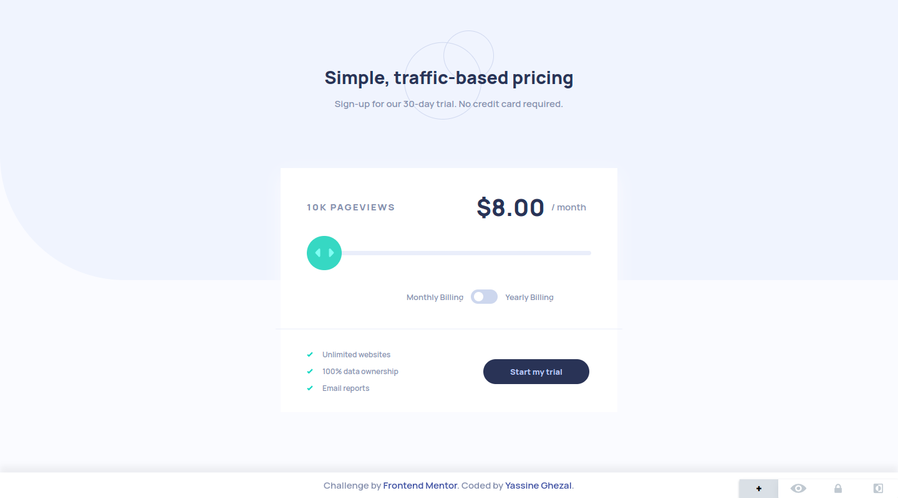
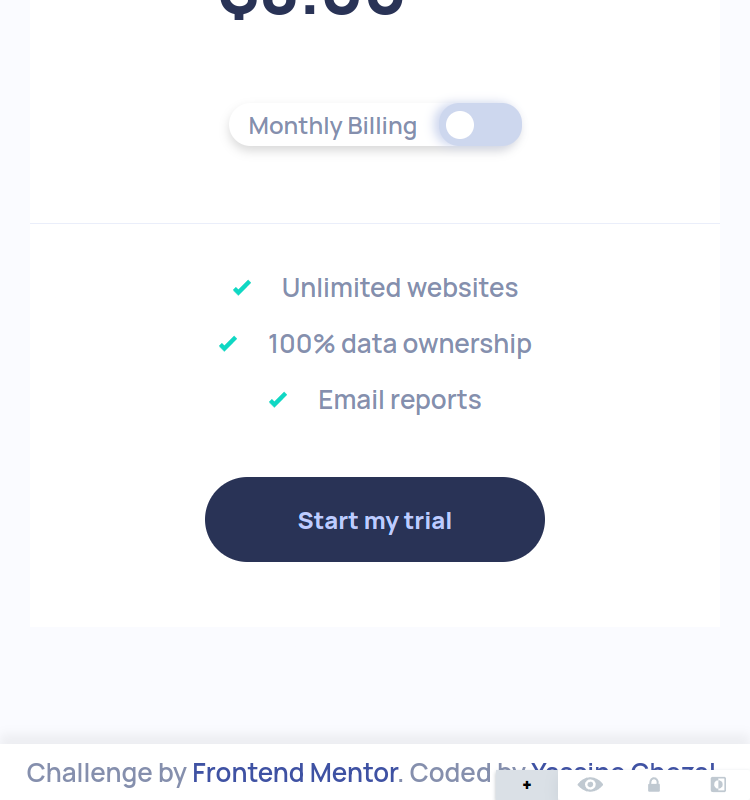

# Frontend Mentor - Interactive pricing component solution

This is a solution to the [Interactive pricing component challenge on Frontend Mentor](https://www.frontendmentor.io/challenges/interactive-pricing-component-t0m8PIyY8). Frontend Mentor challenges help you improve your coding skills by building realistic projects. 

## Table of contents

- [Overview](#overview)
  - [The challenge](#the-challenge)
  - [Screenshot](#screenshot)
  - [Links](#links)
- [My process](#my-process)
  - [Built with](#built-with)
  - [Useful resources](#useful-resources)
- [Author](#author)

## Overview

### The challenge

Users should be able to:

- View the optimal layout for the app depending on their device's screen size
- See hover states for all interactive elements on the page
- Use the slider and toggle to see prices for different page view numbers

### Screenshot

## Desktop design

## Mobile design

  
  

### Links

- Live Site URL: [Interactive pricing component](https://ryusuke66.github.io/interactive-pricing-component)

## My process

### Built with

- Semantic HTML5 markup
- CSS custom properties
- Flexbox
- CSS Grid
- Mobile-first workflow
- JavaScript

### Useful resources

- [Custom CSS range slider](https://blog.logrocket.com/creating-custom-css-range-slider-javascript-upgrades/) - This resource helped me learn how to customize range inputs and how to modify the slider progress bar.

## Author

- Frontend Mentor - [@Ryusuke66](https://www.frontendmentor.io/profile/Ryusuke66)

